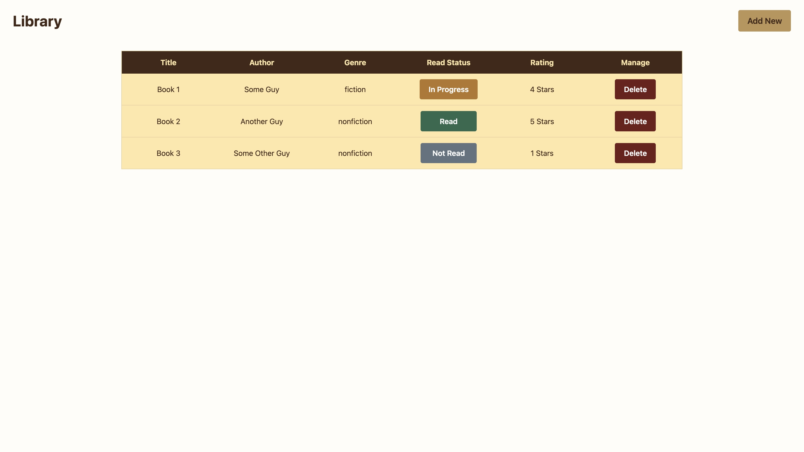
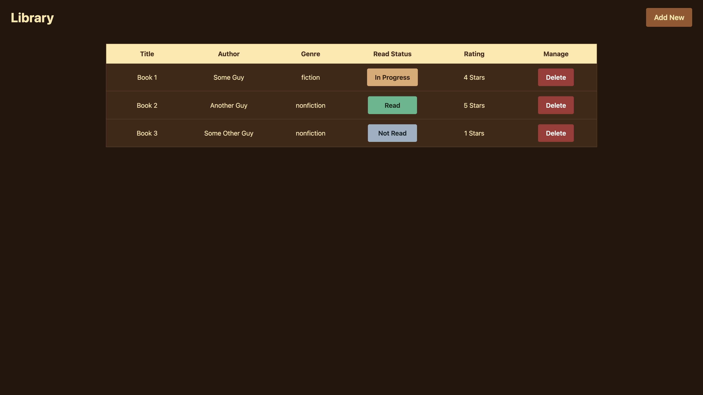
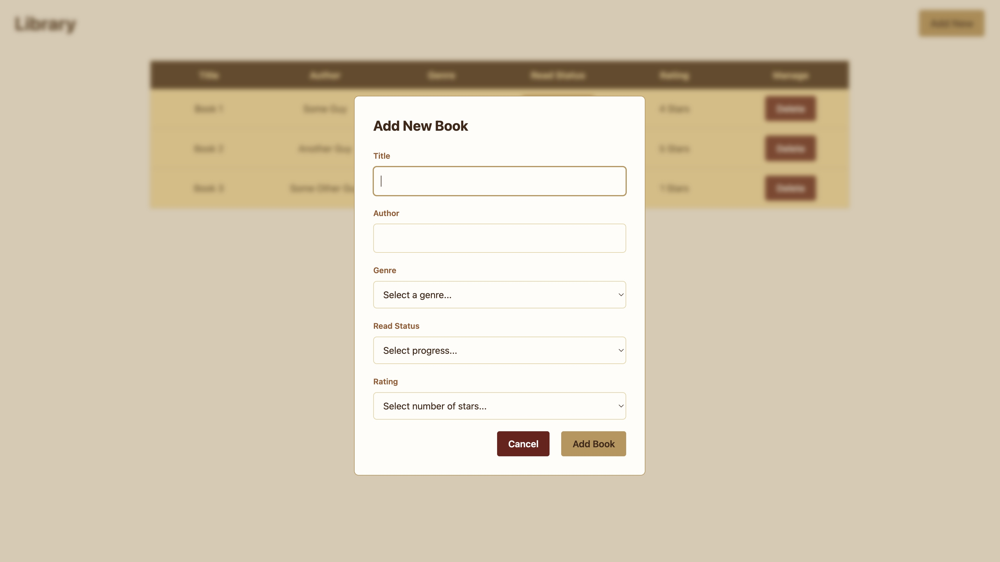
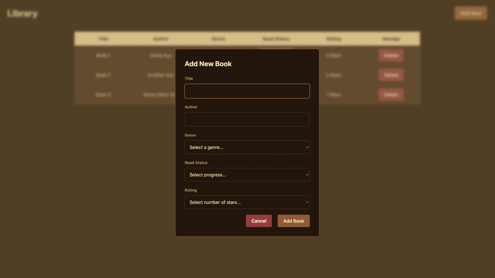

# Library App

A minimalist and elegant bookshelf tracking application. 

---

## Visual Demonstration

| Light Mode | Dark Mode |
| :--- | :--- |
|  |  |
|  |  |

> **Note:** Automatically detects your system's theme settings and switches between Light and Dark mode instantly. 

---

## Features

- **Uses Prototype:** (`Book.prototype.toggleStatus`). 
- **High-Performance:** uses `DocumentFragment`, `replaceChildren()`, and structural event delegation. 

---

## Getting Started

1. **Clone the repository**
2. **Open the project:** open the `index.html` in any modern web browser. 